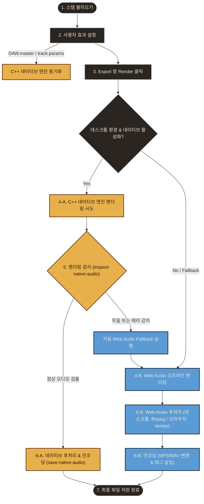

# Export 절차 — 곡 불러오기부터 MP3 저장까지

> 대상 버전: **v1.9.21** 기준
> 이 문서는 사용자가 스템을 불러오고, 효과를 적용하고, 최종 MP3(또는 WAV)로 내보내기까지
> **어느 단계에서 어떤 사용자 설정이 어떻게 신호에 반영되는지**를 단계별로 정리한 것입니다.

---

## 0. 한눈에 보는 전체 흐름



### 요약 흐름도
1. **스템 불러오기**: 오디오 파일 → 디코드(PCM) → 트랙 생성 & 엔진 동기화
   - 데스크톱(JUCE): 압축포맷은 ffmpeg 인메모리 디코딩 후 `MemoryAudioSource` 로드
   - 브라우저/폴백(Web): `AudioBuffer` 로드
2. **사용자 효과 설정**: 트랙별 파라미터 + 마스터 파라미터를 "엔진 상태"에 저장 (`DAW.master`, `track.params`, `clips`)
   - 실시간으로 네이티브 C++ 엔진에 상태 동기화 (볼륨 오토메이션, Ambience 포함)
3. **Export 실행**: Export 창 Render 클릭 → **네이티브 우선** 경로 진입 (`ui-dialogs.jsx`: `ExportDialog.render`)
4. **렌더링 경로 분기**:
   - **[네이티브 경로]**:
     - **4-A. 네이티브 믹스 렌더링**: 실시간 오디오 콜백 일시 중단 후 `transportSource` 경로로 렌더 (오토메이션/EQ/공간 적용), EBU R128 LUFS 정규화 측정 후 임시 WAV 파일 생성.
     - **5. 렌더링 검사**: `inspect-native-audio` IPC를 통해 무음 판정 시 **자동 Web Audio Fallback** 실행.
     - **6-A. 네이티브 후처리 & 인코딩**: `save-native-audio` 호출, ffmpeg로 MP3 인코딩 + ID3v2 태그 및 커버 삽입.
   - **[Web Audio 폴백 경로]**:
     - **4-B. Web Audio 믹스 렌더링**: `OfflineAudioContext` 기반 동일 그래프 생성 및 렌더링.
     - **5-B. Web Audio 후처리**: 데스크톱: ffmpeg (`atempo`, `loudnorm`) / 브라우저: lamejs.
     - **6-B. 인코딩**: MP3/WAV 변환 및 태그 삽입.
5. **7. 파일 저장**: 최종 파일 (.mp3 / .wav) 디스크 기록 및 완료 화면 표시 (Web Audio 폴백 작동 시 "Web Audio fallback used." 안내 노출).


핵심 원칙: **모든 사용자 효과는 “재생 중”에 즉시 거는 것이 아니라, 엔진 상태(`DAW.master`, 각 `track.params`, `clips`)에 값으로 저장**됩니다. Export는 이 저장된 값으로 **동일한 신호 그래프를 오프라인으로 다시 구성**해 한 번에 렌더링합니다.

v1.9.21 기준, **데스크톱 환경에서는 네이티브 C++ 엔진(JUCE) Export를 우선 시도**하며, 렌더링 결과물이 무음으로 판정되거나 에러가 발생할 경우 **Web Audio API 엔진으로 자동 Fallback**하여 무음 Export 사고를 원천 방지합니다.

---

## 1단계 — 스템(곡) 불러오기

진입점: 초기 화면의 **Import Folder / Import Files**, 메뉴 `Project ▸ Import…`, 또는 드래그 앤 드롭.

1. **파일 읽기**:
   - 데스크톱(Electron): `electronAPI.readAudioFile(path)` 로 원본 바이트를 읽음.
   - 브라우저: `<input type=file>` 의 `File.arrayBuffer()`.
2. **디코드 및 트랙 로드**:
   - **Web Audio (브라우저/폴백)**: `ctx.decodeAudioData()` 로 압축 오디오를 PCM 샘플 버퍼로 변환하여 트랙 생성.
   - **네이티브 엔진 (데스크톱)**:
     - MP3, M4A, OGG, FLAC 등 **압축 포맷**은 JUCE 내장 리더의 길이 부정확 문제를 방지하기 위해, **번들 ffmpeg를 사용하여 전체 PCM으로 완벽히 사전 디코딩**한 뒤 임시 WAV 파일을 경유하여 `juce::MemoryAudioSource`로 엔진에 로드합니다 (샘플 단위 정확 seek 및 오토메이션 싱크 보장). 디코딩 완료 후 임시 WAV는 즉시 삭제됩니다.
     - WAV, AIFF 등 **무압축 포맷**은 엔진이 직접 읽어 들입니다.
     - 템포가 1.0(BPM 변경 없음)이고 피치 변경이 없는 경우, 불필요한 레이턴시와 버퍼 예열을 피하기 위해 **SoundTouch 경로를 완전히 우회(Bypass)**합니다.
3. 파일 1개당 **트랙 1개**가 생성됩니다. 트랙 이름은 파일명에서 따오고, 기본 파라미터(`params`)와 전체 길이를 덮는 클립 1개가 함께 만들어집니다.
4. 프로젝트 전체 길이(`DAW.duration`)는 가장 긴 트랙 길이에 맞춰집니다.
5. 초기 빈 화면에서 폴더로 불러온 경우, 폴더 이름이 프로젝트 이름으로 자동 설정됩니다 (v1.9.4).

---

## 2단계 — 사용자 효과 설정 (어디에 저장되나)

사용자가 믹서·트랙 헤더·Advanced Effects 창에서 값을 바꾸면, 그 값은 **엔진 상태에 저장**되고 실시간 재생 그래프 및 네이티브 C++ 엔진에 즉시 동기화됩니다.

### 2-1. 트랙별 설정 — 각 `track.params` / `track.clips`

| 설정 | 저장 위치 | 의미 및 동기화 |
|---|---|---|
| 볼륨(Gain) | `params.volume` | 트랙 재생 레벨 |
| 팬(Pan) | `params.pan` | 좌우 스테레오 위치 (StereoPanner) |
| Mute / Solo | `params.mute` / `params.solo` | 음소거 / 솔로. 네이티브 엔진에서도 상호 배타성 및 Lockstep 싱크 적용 |
| 트랙 Reverb 전송 | `params.reverb` | 공용 리버브로 보내는 양 |
| 트랙 Echo 전송 | `params.echo` | 딜레이(에코)로 보내는 양 |
| 볼륨 오토메이션 | `params.automation` (+ `params.autoOn`) | **v1.9.16부터 네이티브 실시간/Export 모두 완벽 반영**. `setTrackAutomation` 명령을 통해 interleaved 평탄 배열 `[t0,v0,t1,v1...]`로 C++ 엔진에 전달되며, Fritsch-Carlson 단조 큐빅 보간을 적용 |

> **오토메이션 동시성 하드닝 (v1.9.17)**: 재생/Export 스레드가 오토메이션 데이터를 읽는 중에 UI 스레드에서 점을 편집하더라도 메모리 크래시(0xC0000374 힙 손상)가 발생하지 않도록, **불변 스냅샷 + 원자적 교체 (`std::shared_ptr<const TrackAutomation>` + autoMutex)** 방식을 사용합니다.

### 2-2. 마스터(프로젝트 전체) 설정 — `DAW.master`

| 설정 | 키 | 적용 위치 및 네이티브 동기화 |
|---|---|---|
| 9밴드 그래픽 EQ | `master.bands[0..8]` | **v1.9.15 제자리 복사(`*state = *newCoeffs`) 수정**으로 무음 에러 해결. 계수 갱신은 스레드 안전하게 오디오 스레드에서 `eqDirty` 플래그를 통해 수행 |
| EQ 프리셋 | `master.eqPreset` | 프리셋 선택 시 풀린 9밴드 값을 `setMasterBands`로 전송하여 네이티브 엔진에도 실시간 반영 (v1.9.18) |
| 마스터 Reverb | `master.reverb` | 마스터 병렬 리버브 |
| 마스터 Echo/Delay | `master.echo` | 마스터 병렬 딜레이(피드백) |
| Ambience(공간) | `master.room`, `master.roomParams` | **v1.9.19부터 네이티브 엔진 이식 완료**. 웹 버전 `makeRoomIR`과 완전히 동일한 룸 IR을 C++ 내에서 동적으로 생성하여 `juce::dsp::Convolution` 병렬 wet send로 렌더링 |
| Saturation | `master.saturation` | 마스터 배음 새추레이션 (오프라인/네이티브 렌더링 공통 반영) |
| Widener | `master.widener` | 스테레오 폭 확장. 슬라이더 값에 맞게 웹과 네이티브의 M/S 가중치 계수를 동기화 (`1.0 + width * 1.5`) |
| Exciter/Enhancer | `master.exciter` | 고역 배음 강화. 웹 엔진과 동일하게 선형 고역 부스트 + 2차 배음 수식을 C++에 적용하여 음색 일치 |
| Fade In / Out | `master.fadeIn` / `master.fadeOut` | 마스터 페이드 자동화 |
| 마스터 Volume | `master.volume` | **모니터링 전용 — Export에는 반영 안 함** (렌더 그래프에서 게인 1.0 고정) |

---

## 3단계 — Export 실행 & 경로 분기

`Export` 버튼 또는 `Project ▸ Export…` → **Export mixdown** 창에서 형식/품질/태그를 정하고 **Render** 클릭.

### 3-1. 네이티브 우선 및 자동 Fallback 정책 (v1.9.8)

1. **네이티브 시도**: 데스크톱 환경(JUCE 연결 상태)인 경우, 우선 네이티브 `export` 명령을 Websocket으로 C++ 엔진에 전송합니다.
   - 네이티브 엔진에 트랙이 하나도 로드되어 있지 않으면 즉시 실패 처리되어 Web Audio fallback으로 분기합니다 (v1.9.7).
2. **결과물 검사 (inspect-native-audio)**: C++ 엔진이 임시 WAV 파일로 믹스를 뽑아내면, Electron 메인 프로세스가 이 파일의 RIFF/WAVE 데이터 청크를 직접 읽어 Peak 및 RMS 값을 계산합니다.
   - **무음 판정**: `peak < 0.0001` 이고 `rms < 0.00001`인 경우, 네이티브 엔진 렌더링이 무음(Silence)으로 실패했다고 판단합니다 (과거 EQ 계수 미전파 버그 등으로 인한 무음 파일 방지).
3. **Web Audio Fallback**: 네이티브 렌더링 도중 에러가 나거나 무음으로 판정되면, UI는 동일한 설정으로 **Web Audio API 오프라인 렌더러 (`OfflineAudioContext`)를 호출하여 다시 렌더링을 수행**합니다.
   - Fallback 렌더링이 완료되면 저장 후 결과 화면에 **"Web Audio fallback used."** 경고 안내를 표시합니다.

---

## 4단계 — 믹스 렌더링 (신호 체인)

### 4-A. 네이티브 C++ 엔진 (JUCE) 렌더링 경로

1. **실시간 콜백 분리 (v1.9.10)**: 오프라인 렌더링 중 실시간 디바이스 콜백 스레드가 동일한 소스 그래프를 동시에 건드려 병목 및 무음이 발생하는 것을 차단하기 위해, 실시간 `sourcePlayer` 콜백을 일시적으로 분리(`removeAudioCallback`)한 후 렌더링을 진행합니다. 완료 후 복구됩니다.
2. **일관된 TransportSource 경로 사용 (v1.9.15)**: 기존의 오프라인 직접 읽기(direct-read) 방식은 리샘플링을 누락시켜 무음을 유발하였으므로, 실시간 재생과 완전히 동일하게 `AudioTransportSource`를 거쳐 렌더링 루프를 실행합니다. 렌더 시작 전 `transportSource->setPosition(0)`으로 타임라인을 정렬합니다.
3. **Mute/Solo Lockstep 싱크 (v1.9.18)**: Mute 혹은 Solo 비활성 상태인 트랙이라도 `transportSource->getNextAudioBlock()`은 **항상 호출하여 진행 위치를 정렬**한 뒤 버퍼를 0으로 지웁니다. 이를 통해 재생/정지 반복 및 뮤트 토글 시의 트랙 간 싱크 뒤틀림을 근본적으로 해결했습니다.
4. **신호 체인**:
   ```
   각 트랙 (MemoryAudioSource / ReaderSource)
     → SoundTouch (BPM/Key 변경 시 피치 보존 스트레칭)
     → Fader Gain (Static Volume × 볼륨 오토메이션 값)
     → Panner (Static Pan)
     → Mixer Master Input
   
   마스터 버스
     → 9밴드 EQ (peaking 필터 9개, 제자리 복사 적용)
     → Fade Gain (fadeIn / fadeOut 램프)
     → 마스터 Volume Gain (Export 시 1.0 고정)
         ├─→ 드라이 출력
         ├─→ 마스터 Reverb (Convolver)
         ├─→ 마스터 Echo (Delay + 피드백)
         └─→ Ambience (C++ generateRoomIR + juce::dsp::Convolution)
     → Saturation → Widener → Exciter
     → EBU R128 LUFS 정규화 필터 (2-Pass 측정 및 게인 보정, 실패 시 raw RMS fallback)
     → 임시 WAV 파일로 Write
   ```

### 4-B. Web Audio 폴백 (브라우저) 렌더링 경로

`renderMix`([audio-engine.js](audio-engine.js))는 `OfflineAudioContext` 내에 실시간 재생과 동일한 노드 그래프를 복제하여 고속 렌더링합니다.

1. **신규 3종 이펙트 오프라인 반영 (v1.9.6)**: 오프라인 렌더러 그래프에도 **Saturation → Widener → Exciter** 체인을 그대로 복제하여 적용합니다. 단, 무음 회귀 방지를 위해 이펙트 슬라이더 값이 `0`보다 클 때만 체인에 노드를 동적으로 삽입합니다.
2. **종단 리미터 차이**: 실시간 모니터링은 DynamicsCompressor를 사용하지만, 오프라인 Web Audio 렌더링은 ~10ms의 지연으로 파형 끝이 밀리는 현상을 방지하기 위해 **제로-지연 소프트 클리퍼 (WaveShaper)**를 사용합니다.

---

## 5단계 — 후처리 (선택)

- **네이티브 경로**: EBU R128 정규화 및 피치 보존 템포 변경은 C++ 엔진(JUCE/SoundTouch) 내부에서 직접 처리하여 임시 파일로 작성하므로 별도의 후처리가 불필요합니다.
- **Web Audio 폴백 경로**:
  - 데스크톱(Electron): 렌더링된 PCM WAV 버퍼를 `electronAPI.processAudio`를 통해 메인 프로세스로 전달하여, ffmpeg의 `atempo`(피치 보존 템포) 및 `loudnorm`(2-pass linear LUFS 정규화) 필터 체인으로 한 번에 처리합니다.
  - 브라우저: ffmpeg를 사용할 수 없으므로, 4단계의 소프트 클리퍼만 적용된 오디오 버퍼를 그대로 사용합니다.

---

## 6단계 — 인코딩 (MP3 / WAV)

### 6-A. 네이티브 경로 저장 시 인코딩
최종 저장 경로가 결정되면 `electronAPI.saveNativeAudio`를 통해 임시 WAV 파일을 인코딩합니다.
- **WAV 저장**: 임시 WAV 파일을 최종 저장 경로로 직접 복사하고 임시 파일을 삭제합니다.
- **MP3 저장**: 번들 ffmpeg를 활용하여 임시 WAV를 MP3로 변환하며, 사용자가 설정한 메타데이터 태그(Title, Artist, Album, Year, Date)와 선택한 앨범 커버 아트(Preset 또는 Custom 이미지)를 **ID3v2.3 규격**으로 인코딩하여 파일에 삽입합니다.

### 6-B. Web Audio 폴백 경로 인코딩
- **MP3 (데스크톱)**: 렌더링된 AudioBuffer를 임시 WAV ArrayBuffer로 변환한 뒤, `electronAPI.encodeMp3`로 전달하여 ffmpeg를 통해 ID3v2 태그 및 커버 아트를 결합한 MP3 바이너리를 얻습니다.
- **MP3 (브라우저)**: `lamejs` 라이브러리로 MP3를 인코딩한 뒤, **UTF-16 LE BOM 규격**으로 직접 작성한 ID3v2.3 태그 바이너리를 앞에 수동 병합하여 한글 깨짐이 없는 최종 MP3 Blob을 만듭니다.
- **WAV**: `audioBufferToWav()` 헬퍼를 사용해 RIFF INFO 청크 태그가 포함된 WAV Blob을 생성합니다.

---

## 7단계 — 파일 저장

사용자가 최종적으로 **Save file**을 누르면 최종 디스크 저장이 수행됩니다.
- **데스크톱 (Electron)**: OS의 네이티브 Save Dialog를 띄워 덮어쓰기 여부를 확인한 뒤, 인코딩이 완료된 최종 오디오 데이터를 지정된 경로에 안전하게 기록합니다.
- **브라우저**: HTML5 `<a download>` 속성을 통해 브라우저 기본 다운로드 경로로 파일을 저장합니다.

---

## 부록 — 단계별 책임 파일 및 API

| 단계 | 주요 파일 / 함수 / IPC | 역할 |
|---|---|---|
| **불러오기 / 디코드** | `app.jsx` (`addElectronFiles` / `addFiles`) <br> `audio-engine.js` (`addFileBuffer` / `addFile`) <br> `AudioEngine.cpp` (`loadTrack`) | 미디어 디코드 및 트랙 리소스 초기화. 데스크톱 MP3는 ffmpeg 인메모리 PCM 디코딩 적용 |
| **효과 설정 & 동기화** | `audio-bridge.js` (`setTrackParam` / `setRoom` / `setMasterBands` / `sendTrackAutomationToNative`) | UI 상태 변화를 실시간으로 네이티브 C++ Websocket 서버에 전송 |
| **Export 실행** | `ui-dialogs.jsx` (`ExportDialog.render`) | Export 옵션 수집 및 네이티브 우선 렌더링 실행 후 무음 시 Web Audio 폴백 수행 |
| **무음 감지** | `electron/main.js` (`inspect-native-audio` IPC) | 렌더링된 네이티브 임시 WAV의 Peak / RMS 실측 및 무음 판별 |
| **믹스 렌더 (Native)** | `AudioEngine.cpp` (`exportMix`) <br> `AudioEngine.h` (`TrackAudioSource` / `MasterEffectsAudioSource`) | 실시간 콜백 정지 후 transportSource 기반 정밀 렌더 및 C++ 내장 Ambience / 볼륨 오토메이션 결합 |
| **믹스 렌더 (Web)** | `audio-engine.js` (`renderMix`) | OfflineAudioContext 기반 복제 그래프 렌더링 및 Saturation/Widener/Exciter 삽입 |
| **후처리 & 인코딩** | `electron/main.js` (`process-audio` / `encode-mp3` / `save-native-audio` IPC) | ffmpeg를 이용한 2-pass LUFS 라우드니스 보정, 피치 보존 템포 조절, ID3v2 태그 및 앨범 아트 병합 |

---

## 참고 — 정상 상황에서 Web Audio API를 사용하는 기준

네이티브 엔진 오류로 인한 폴백(Fallback) 상황 외에, **정상적인 동작 흐름**에서 Web Audio API(LocalDAW)를 주 엔진으로 사용하는 시나리오는 다음과 같습니다.

1. **웹 브라우저 환경에서 작동할 때**
   - FocusDAW Studio를 Electron 데스크톱 앱이 아닌 일반 웹 브라우저 상에서 구동할 경우, `electronAPI` 및 로컬 오디오 엔진 바이너리가 동작하지 않으므로 웹소켓 연결이 이루어지지 않습니다. 이때 브릿지(`audio-bridge.js`)가 비활성화되며 **Web Audio API가 기본 오디오 출력 및 렌더러로 정상 작동**합니다.
2. **데스크톱 환경에서 네이티브 엔진 바이너리 기동 실패 또는 네트워크 차단 시**
   - 백신/방화벽 프로그램에 의해 C++ 엔진 프로그램(`FocusDAW-AudioEngine`) 실행이 차단되었거나, 포트(8082) 충돌 등으로 웹소켓 접속 시도가 5회 이상 실패(Timeout)할 경우 앱은 데스크톱 환경이더라도 자연스럽게 **Web Audio API 출력 상태를 활성화(Mute 해제)하여 정상 구동을 유지**합니다.

