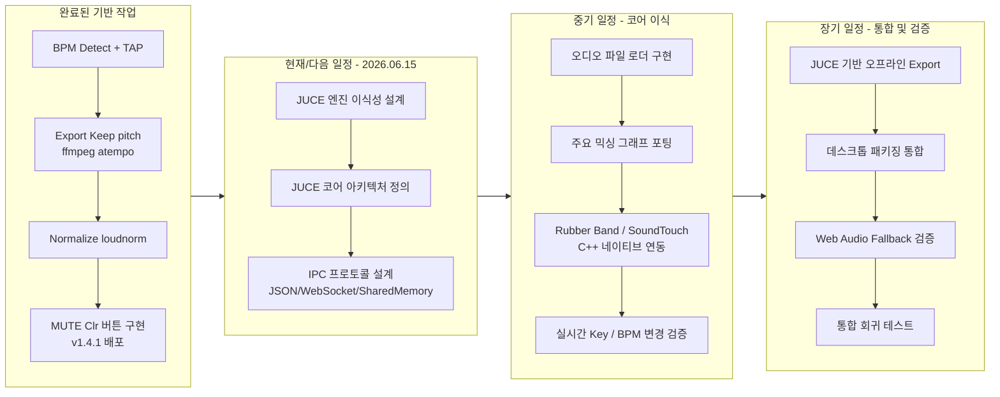
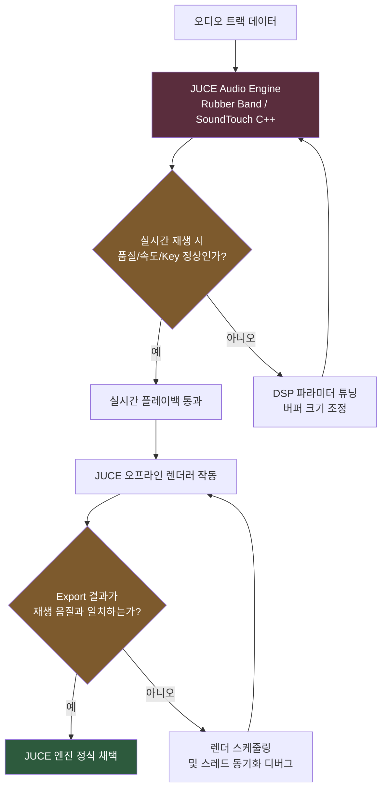
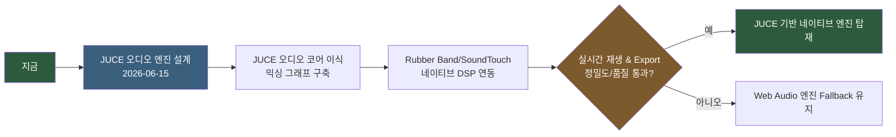

# FocusDAW — 개발 프로세스 (Mermaid)

> [앱개발.md](앱개발.md)의 **섹션 2(목표) · 3(개발 방향 및 세부 계획) · 5(검토 항목)** 을 도식화한 문서입니다.
> 원문이 단일 소스이며, 본 문서는 그 시각화 사본입니다. 내용이 충돌하면 [앱개발.md](앱개발.md)가 우선합니다.
> 기준 버전: `v1.4.1` (2026-06-15)

---

## 1. 현재 상태 요약

현재 `v1.4.1` 기준으로 BPM 측정, 전역 BPM 조정, MUTE Clr(Mute/Solo 전체 해제) 기능, 그리고 캐시형 실시간 Time Stretch 프리뷰가 모두 구현 및 검증 완료되었습니다. Web Audio API 엔진이 가진 실시간 고품질 DSP의 한계와 실시간/내보내기 음질 괴리 문제를 극복하기 위해, **C++ JUCE 기반의 네이티브 오디오 엔진 마이그레이션**을 적극적인 다음 개발 항목으로 선정하고 설계 프로세스를 개시합니다.

```mermaid
flowchart TD
    START([v1.4.1<br/>현재 기준])

    DONE0[✅ Phase 0<br/>전역 BPM 조정<br/>playbackRate 기반]
    DONE1[✅ Phase 1<br/>BPM Detection + TAP<br/>Meyda STFT/ACF 기반]
    DONE2[✅ Export Keep pitch 기준선<br/>ffmpeg atempo<br/>실제 MP3 청감 확인]
    DONE3[✅ Help/Manual 표현 정리<br/>단기 안정 기능으로 안내]
    DONE4[✅ Manual/Help 화면 확인<br/>v1.2.32 화면 및 한/영 토글]
    DONE5[✅ Vari BPM 트랙 라벨<br/>BPM 표시 확인]
    DONE6[✅ Vari BPM 실시간<br/>Time Stretch 프리뷰<br/>캐시형 피치 보존]
    DONE7[✅ 준비 표시/디바운스<br/>500ms 대기/계산 정리]
    DONE8[✅ B-123~B-130<br/>수동 확인 완료]
    DONE9[✅ MUTE Clr 버튼 추가<br/>Mute/Solo 일괄 초기화 & Undo]
    DONE10[✅ B-131 수동 검증 완료<br/>시험 아카이브 보관]

    NOW[지금 진행<br/>JUCE 전환 설계 시작<br/>2026-06-15]
    
    JUCE_PLAN[JUCE 마이그레이션 세부 계획 수립<br/>개발-프로세스.md 및 앱개발.md 반영]
    JUCE_IPC[1단계: 코어 및 IPC 프로토콜 설계<br/>Electron-JUCE 간 통신 규격 정의]
    JUCE_CORE[2단계: 재생 및 트랙 믹싱 이식<br/>오디오 디코더 & 믹싱 그래프]
    JUCE_DSP[3단계: 네이티브 DSP 통합<br/>Rubber Band / SoundTouch 실시간]
    JUCE_EXPORT[4단계: 오프라인 렌더링 구현<br/>Loudnorm & 오디오 포맷 라이터]
    JUCE_INTEG[5단계: Electron 패키징 및<br/>Web Audio Fallback 통합]

    START --> DONE0 --> DONE1 --> DONE2 --> DONE3 --> DONE4 --> DONE5 --> DONE6 --> DONE7 --> DONE8 --> DONE9 --> DONE10 --> NOW --> JUCE_PLAN --> JUCE_IPC --> JUCE_CORE --> JUCE_DSP --> JUCE_EXPORT --> JUCE_INTEG

    style START fill:#2d5a3d,color:#fff
    style DONE0 fill:#2d5a3d,color:#fff
    style DONE1 fill:#2d5a3d,color:#fff
    style DONE2 fill:#2d5a3d,color:#fff
    style DONE3 fill:#2d5a3d,color:#fff
    style DONE4 fill:#2d5a3d,color:#fff
    style DONE5 fill:#2d5a3d,color:#fff
    style DONE6 fill:#2d5a3d,color:#fff
    style DONE7 fill:#2d5a3d,color:#fff
    style DONE8 fill:#2d5a3d,color:#fff
    style DONE9 fill:#2d5a3d,color:#fff
    style DONE10 fill:#2d5a3d,color:#fff
    style NOW fill:#3a5f7d,color:#fff
    style JUCE_PLAN fill:#7d5a2d,color:#fff
    style JUCE_IPC fill:#5a2d3d,color:#fff
    style JUCE_CORE fill:#5a2d3d,color:#fff
    style JUCE_DSP fill:#5a2d3d,color:#fff
    style JUCE_EXPORT fill:#5a2d3d,color:#fff
    style JUCE_INTEG fill:#5a2d3d,color:#fff
```



---

## 2. 단계별 일정



---

## 3. JUCE 네이티브 DSP 통합 및 검증 흐름

실시간 피치/템포 변환은 Rubber Band 및 SoundTouch C++ 원본 라이브러리를 직접 탑재하여 수행하며, 재생 음질 및 내보내기 결과의 일치성을 최우선으로 검증합니다.



---

## 4. 현재 우선순위

| 우선순위 | 작업 | 상태 | 기준 |
|---|---|---|---|
| 1 | JUCE 전환 설계 및 IPC 프로토콜 정의 | 진행 중 (2026-06-15) | Electron 메인 프로세스와 JUCE C++ 엔진 간의 데이터 프로토콜 설계 완료 |
| 2 | JUCE 오디오 파일 로더 및 트랙 믹싱 구현 | 대기 | `juce::AudioProcessorGraph`를 활용한 믹싱 파이프라인 수립 |
| 3 | JUCE 네이티브 DSP (Time Stretch / Pitch Shift) 통합 | 대기 | Rubber Band / SoundTouch C++ 소스 컴파일 및 실시간 피치/템포 적용 |
| 4 | JUCE 오프라인 렌더링 (Export) 구현 | 대기 | 실시간 오디오 그래프를 WAV/MP3 파일로 덤프하는 네이티브 익스포터 구축 |
| 5 | Electron 패키징 및 Fallback 시스템 통합 | 대기 | 플랫폼별 JUCE 빌드 동봉 및 로드 실패 시 Web Audio API 폴백 연동 |
| 6 | 시험 문서 운영 | 상시 | 완료 항목은 `시험-아카이브.md`로 이동, `시험.md`에는 대기 항목만 유지 |

---

## 5. 향후 검토 항목 백로그

```mermaid
flowchart TD
    ROOT[검토 항목 · 아이디어 노트]

    R1[Mixer 창 외부 분리<br/>독립 BrowserWindow + IPC]
    R2[VST3 효과 추가<br/>Limiter·Compressor·Imager·Exciter·Meter]
    R3[JUCE 핵심 엔진 전환<br/>✅ 진행 중 (2026-06-15)]
    R4[Cloud Sync<br/>Google Drive 연동]
    R5[변동 BPM / Tempo Map<br/>비트 그리드·워프 도입 시 재검토]
    R6[Help find 기능<br/>✅ v1.1.9 완료]

    ROOT --> R1
    ROOT --> R2
    ROOT --> R3
    ROOT --> R4
    ROOT --> R5
    ROOT --> R6

    style R3 fill:#3a5f7d,color:#fff
    style R6 fill:#2d5a3d,color:#fff
```

| # | 항목 | 상태 | 비고 |
|---|---|---|---|
| 1 | Mixer 창 외부 분리 | 검토 | 다중 모니터 대응 |
| 2 | VST3 효과 추가 | 검토 | Limiter/Compressor/Imager/Exciter/Meter |
| 3 | JUCE 엔진 전환 | 진행 중 | 2026-06-15 설계 및 마이그레이션 기획 개시 |
| 4 | Cloud Sync | 검토 | `.focus` + Stem 동기화 |
| 5 | 변동 BPM / Tempo Map | 보류 | 비트 그리드·워프·스템 정렬 기능 시작 시 재검토 |
| 6 | Help find | ✅ 완료 | v1.1.9 (B-21·B-22 시험 완료) |

---

## 6. 핵심 메시지



> **핵심 메시지**: `v1.4.1`에서 MUTE Clr 수동 검증 완료에 따라 Web Audio 기반 고도화를 마무리하고, 2026-06-15부로 JUCE C++ 네이티브 오디오 엔진으로의 마이그레이션 계획을 본격화합니다. 실시간 템포/키 변경 품질을 보장하기 위해 Rubber Band/SoundTouch를 네이티브 수준에서 통합하고, 빌드/안정성 오류를 대비한 Web Audio API Fallback 구동 방식을 설계에 포함합니다.
