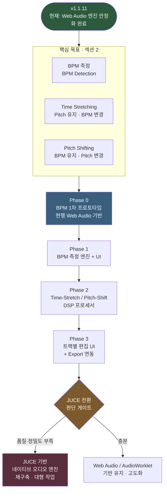
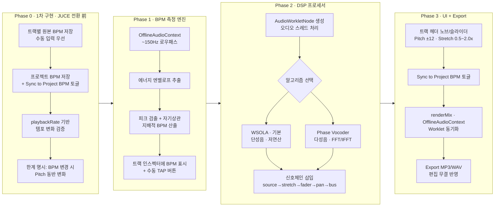
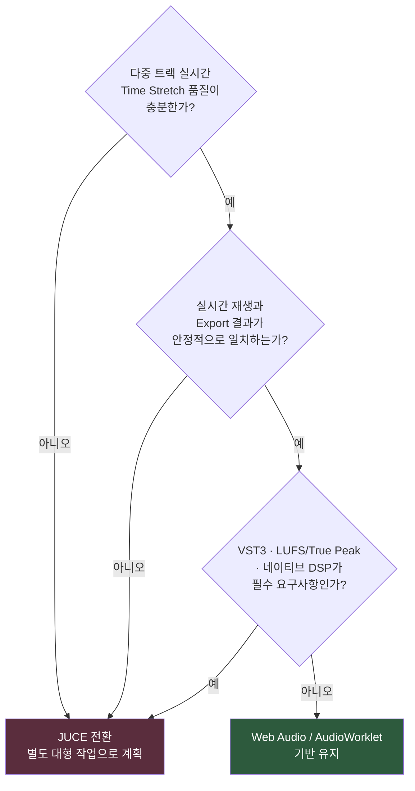
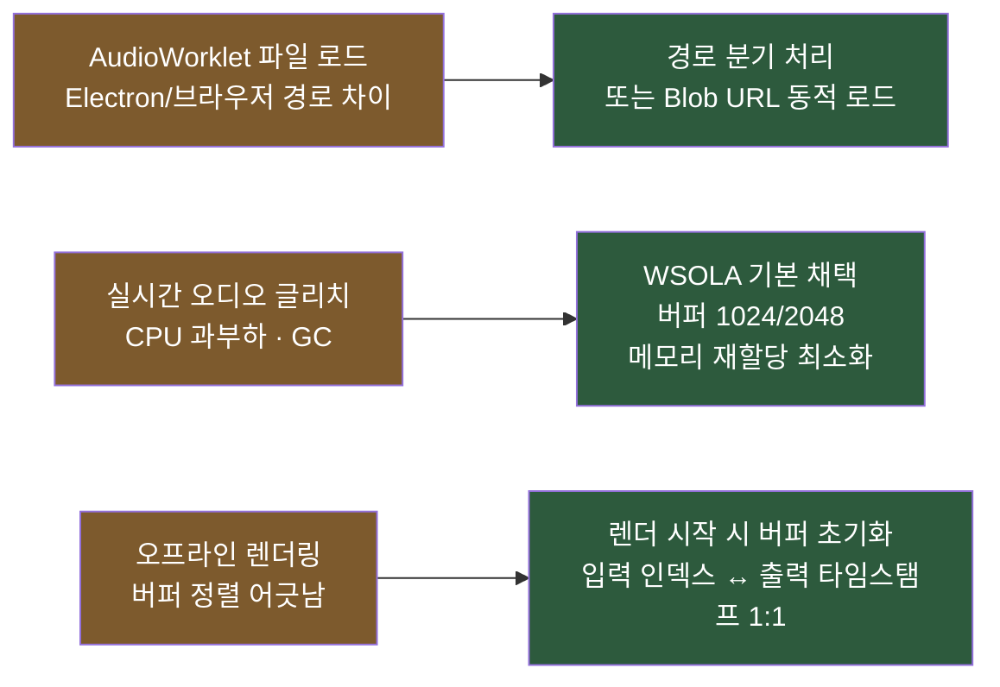
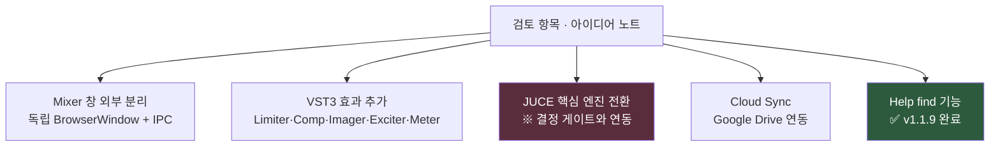
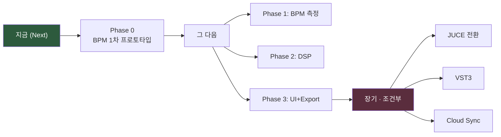

# FocusDAW — 개발 프로세스 (Mermaid)

> [앱개발.md](앱개발.md)의 **섹션 2(목표) · 3(개발 방향 및 세부 계획) · 5(검토 항목)** 을 도식화한 문서입니다.
> 원문이 단일 소스이며, 본 문서는 그 시각화 사본입니다. 내용이 충돌하면 [앱개발.md](앱개발.md)가 우선합니다.
> 기준 버전: `v1.1.11`

---

## 1. 전체 로드맵 (Phase Flow)

현재 출발점은 `v1.1.11`(Mixer 창 버그 수정 + Electron 42 보안 업데이트 완료)이며,
다음 핵심 목표는 **트랙별 시간(BPM)·주파수(Pitch) 제어 고도화**입니다.

---

## 2. 단계별 세부 작업 (Phase Detail)

---

## 3. JUCE 전환 판단 기준 (Decision Gate)

Phase 0~3 완료 후, 아래 조건을 평가하여 JUCE 네이티브 엔진 전환 여부를 결정합니다.

---

## 4. 예상 이슈 → 대처 (섹션 4)

---

## 5. 향후 검토 항목 백로그 (섹션 5)

핵심 Phase 로드맵과 별개로, 사용자 검토 대상 아이디어입니다.

| # | 항목 | 상태 | 비고 |
|---|---|---|---|
| 1 | Mixer 창 외부 분리 | 검토 | 다중 모니터 대응 |
| 2 | VST3 효과 추가 | 검토 | Limiter/Compressor/Imager/Exciter/Meter |
| 3 | JUCE 엔진 전환 | 조건부 | §3 결정 게이트 충족 시 |
| 4 | Cloud Sync | 검토 | `.focus` + Stem 동기화 |
| 5 | Help find | ✅ 완료 | v1.1.9 (B-21·B-22 시험 완료) |

---

## 6. 우선순위 요약

> **핵심 메시지**: JUCE 전환은 *먼저* 하지 않는다. 현행 Web Audio 위에서 BPM 기능의
> 데이터 모델·UX·Export 요구사항을 **Phase 0에서 먼저 확정**한 뒤, 품질이 부족할 때만
> JUCE 전환을 별도 대형 작업으로 진행한다. (섹션 3 Phase 0 결론)
