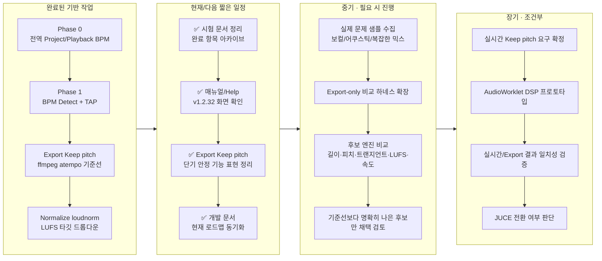
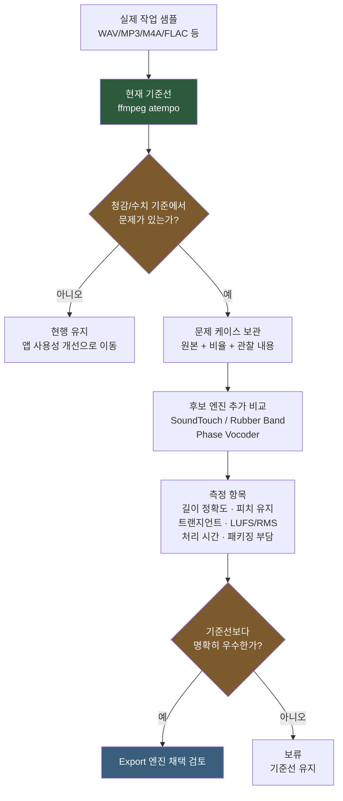
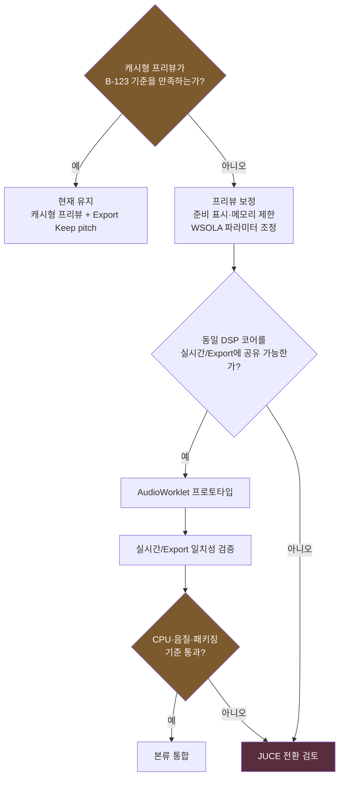
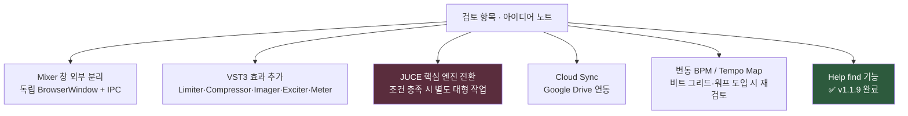
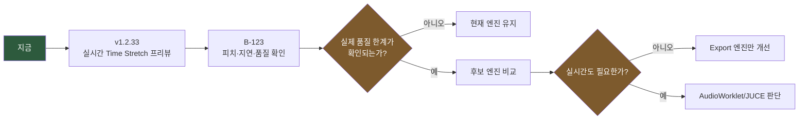

# FocusDAW — 개발 프로세스 (Mermaid)

> [앱개발.md](앱개발.md)의 **섹션 2(목표) · 3(개발 방향 및 세부 계획) · 5(검토 항목)** 을 도식화한 문서입니다.
> 원문이 단일 소스이며, 본 문서는 그 시각화 사본입니다. 내용이 충돌하면 [앱개발.md](앱개발.md)가 우선합니다.
> 기준 버전: `v1.2.40`

---

## 1. 현재 상태 요약

현재 `v1.2.40` 기준으로 BPM 측정, 전역 BPM 조정, Electron Export `Keep pitch` 단기 안정 경로, Help/매뉴얼 표현 정리, 최신 매뉴얼/Help 화면 확인, Vari BPM 트랙 라벨 확인, Vari BPM 실시간 Time Stretch 프리뷰, 프리뷰 준비 표시/연속 BPM 변경 디바운스, 비차단 원형 준비 표시, 트랙 overlay 표시 이동, 트랙 묶음 중앙 배치, 정지 상태 Play 시 준비 표시 paint 보장, Playback BPM 입력 커밋 디바운스, 계산 중 입력 정리까지 완료했고 B-123~B-130 수동 확인도 마쳤습니다. 이제 다음 개발 항목은 실시간 프리뷰 음질/성능의 추가 개선 여부를 실제 사용 피드백 기준으로 판단하는 것입니다.

```mermaid
flowchart TD
    START([v1.2.40<br/>현재 기준])

    DONE0[✅ Phase 0<br/>전역 BPM 조정<br/>playbackRate 기반]
    DONE1[✅ Phase 1<br/>BPM Detection + TAP<br/>Meyda STFT/ACF 기반]
    DONE2[✅ Export Keep pitch 기준선<br/>ffmpeg atempo<br/>실제 MP3 청감 확인]
    DONE3[✅ Help/Manual 표현 정리<br/>단기 안정 기능으로 안내]
    DONE4[✅ Manual/Help 화면 확인<br/>한/영 토글·이미지 표시]
    DONE5[✅ Vari BPM 트랙 라벨<br/>BPM 표시 확인]

    DONE6[✅ Vari BPM 실시간<br/>Time Stretch 프리뷰<br/>캐시형 피치 보존]
    DONE7[✅ 준비 표시/디바운스<br/>연속 BPM 변경 응답성 보정]
    DONE8[✅ 비차단 준비 표시<br/>작은 원형 서클<br/>BPM 패널 유지]
    DONE9[✅ 준비 표시 위치 보정<br/>트랙 overlay<br/>툴바 레이아웃 불변]
    DONE10[✅ 준비 표시 중앙 배치<br/>현재 보이는 트랙 묶음<br/>중앙 기준]
    DONE11[✅ 정지 상태 Play<br/>준비 표시 선표시<br/>paint 보장]
    DONE12[✅ BPM 입력 커밋<br/>UI draft 표시<br/>마지막 값만 적용]
    DONE13[✅ 계산 중 입력 정리<br/>500ms 대기<br/>pending clear]
    DONE14[✅ B-123~B-130<br/>수동 확인 완료<br/>UX 안정화]
    NOW[지금 진행<br/>후속 품질/성능 판단<br/>실사용 피드백 기준]
    NEXT{현재 atempo 결과가<br/>실제 곡에서 부족한가?}

    HOLD[보류 유지<br/>현행 atempo 경로 유지<br/>사용성 개선 우선]
    BENCH[비교 하네스 확장<br/>SoundTouch / Rubber Band<br/>Phase Vocoder 후보 측정]
    REALTIME{실시간 피치 보존이<br/>필수 요구사항인가?}
    WORKLET[AudioWorklet 실시간 DSP<br/>후보 엔진 검증 후 적용]

    GATE{Web Audio 한계가<br/>명확한가?}
    JUCE[JUCE 네이티브 엔진 전환<br/>별도 대형 작업]
    KEEP[Web Audio / Electron Export<br/>기반 유지]

    START --> DONE0 --> DONE1 --> DONE2 --> DONE3 --> DONE4 --> DONE5 --> DONE6 --> DONE7 --> DONE8 --> DONE9 --> DONE10 --> DONE11 --> DONE12 --> DONE13 --> DONE14 --> NOW --> NEXT
    NEXT -->|아니오| HOLD --> KEEP
    NEXT -->|예| BENCH --> REALTIME
    REALTIME -->|아니오| KEEP
    REALTIME -->|예| WORKLET --> GATE
    GATE -->|아니오| KEEP
    GATE -->|예| JUCE

    style START fill:#2d5a3d,color:#fff
    style DONE0 fill:#2d5a3d,color:#fff
    style DONE1 fill:#2d5a3d,color:#fff
    style DONE2 fill:#2d5a3d,color:#fff
    style DONE3 fill:#2d5a3d,color:#fff
    style DONE4 fill:#2d5a3d,color:#fff
    style DONE5 fill:#2d5a3d,color:#fff
    style NOW fill:#3a5f7d,color:#fff
    style NEXT fill:#7d5a2d,color:#fff
    style REALTIME fill:#7d5a2d,color:#fff
    style GATE fill:#7d5a2d,color:#fff
    style JUCE fill:#5a2d3d,color:#fff
```

---

## 2. 단계별 일정

---

## 3. Time Stretch 진행 기준

Time Stretch 고도화는 “새 엔진이 좋아 보인다”가 아니라 “현행 `ffmpeg atempo`가 실제 작업에서 부족하다”는 신호가 있을 때 시작합니다.

---

## 4. 실시간 Keep Pitch 판단 기준

실시간 피치 보존은 Export보다 범위가 큽니다. v1.2.33에서는 AudioWorklet로 바로 들어가지 않고 캐시형 Time Stretch 프리뷰를 먼저 붙였으므로, B-123 결과에 따라 이 경로를 보정할지 AudioWorklet 단계로 넘어갈지 판단합니다.

---

## 5. 현재 우선순위

| 우선순위 | 작업 | 상태 | 기준 |
|---|---|---|---|
| 1 | Vari BPM 실시간 Time Stretch 확인 | ✅ 완료 | v1.2.40 캐시형 프리뷰가 B-123~B-130에서 피치/지연/응답성 기준을 만족함 |
| 2 | 실시간 Keep pitch 품질 보정 | 다음 | 실제 곡에서 프리뷰 음질/성능 한계가 다시 확인될 때 메모리 제한, WSOLA 파라미터 또는 AudioWorklet 전환 필요성 판단 |
| 3 | 시험 문서 운영 | 상시 | 완료 항목은 `시험-아카이브.md`로 이동, `시험.md`에는 대기 항목만 유지 |
| 4 | Export Keep pitch 표현 정리 | ✅ 완료 | v1.2.32에서 단기 안정 기능으로 Help/매뉴얼 표현 정리, B-121 확인 완료 |
| 5 | 매뉴얼/Help v1.2.32 화면 확인 | ✅ 완료 | 한/영 토글, 최신 스크린샷, Help 이미지/문구 B-122 확인 완료 |
| 6 | JUCE 전환 | 장기 | Web Audio/AudioWorklet로 품질·정밀도·성능 요구를 만족하지 못할 때만 별도 대형 작업 |

---

## 6. 향후 검토 항목 백로그

핵심 Phase 로드맵과 별개로, 사용자 검토 대상 아이디어입니다.

| # | 항목 | 상태 | 비고 |
|---|---|---|---|
| 1 | Mixer 창 외부 분리 | 검토 | 다중 모니터 대응 |
| 2 | VST3 효과 추가 | 검토 | Limiter/Compressor/Imager/Exciter/Meter |
| 3 | JUCE 엔진 전환 | 조건부 | AudioWorklet/Web Audio 한계가 확정될 때 |
| 4 | Cloud Sync | 검토 | `.focus` + Stem 동기화 |
| 5 | 변동 BPM / Tempo Map | 보류 | 비트 그리드·워프·스템 정렬 기능 시작 시 재검토 |
| 6 | Help find | ✅ 완료 | v1.1.9 (B-21·B-22 시험 완료) |

---

## 7. 핵심 메시지

> **핵심 메시지**: v1.2.33에서 Time Stretch 본류를 시작했다. 현재는 캐시형 실시간 프리뷰와 Electron Export의 `ffmpeg atempo` 경로를 병행 유지하고, B-123에서 실제 품질 한계가 확인될 때만 AudioWorklet/JUCE 후보 검토를 확장한다.
