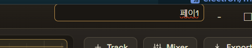

# 지침

*중요*
1. 아래의 수정 요청 사항을 수정하고 "앱개발.md"에 업데이트 내용을 기록할 것.
2. 수정이 완료되었으면 아래의 수정요청 항목을 삭제하고 이 파일을 업데이트 할 것.

# 수정요청 항목
1. 메인 화면 project title box 윗쪽 잘림 문제

project title box를 조금 아래로 내려야 할 듯. (윗쪽 노란선이 잘려나감) - 중앙의 시간을 표시하는 box 부분이 정상적으로 보임.

2. Automation
volume automation이 화면에서 보는 것과 실제 음악에 적용되는 부분이 다른 것 같음.
- 현재 play 중인 부분과 관계 없는 부분을 추가해서 올리면 갑자기 현재 플레이 소리가 올라감.
- 플레이 바를 임의로 클릭해서 옮기면 현재의 automation 값이 적용되는 것이 아니라 이전의 automation 값이 플레이 되는 것 처럼 들림. 실제 track의 재생시점과 automation 적용 시점의 sync 문제로 생각됨 - 정확하지는 않음.

