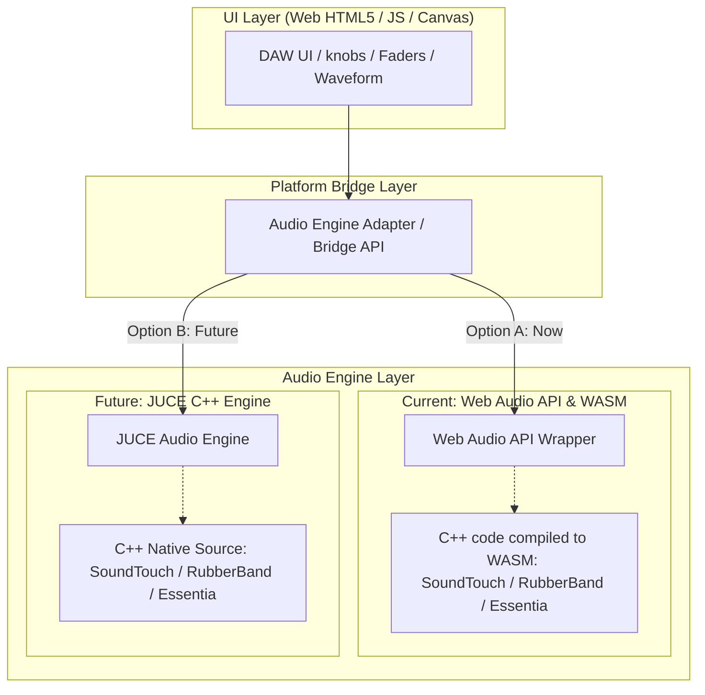
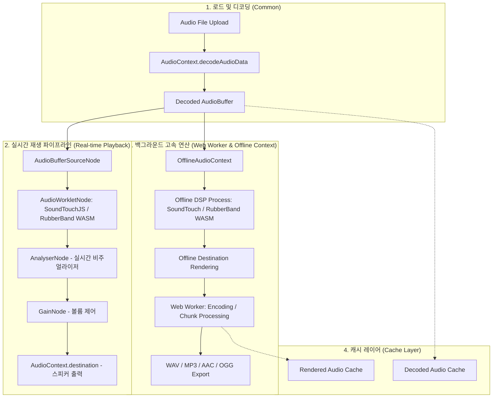
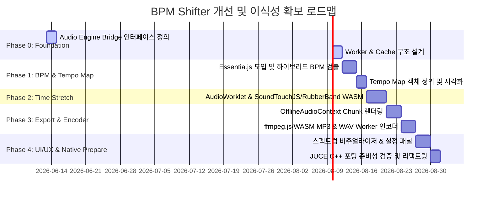

# Beat Motion Studio - BPM Shifter 성능 및 기능 개선 제안서 (JUCE 마이그레이션 대응판)

본 제안서는 아래의 **두 가지 핵심 목표 기능**을 안정적이고 고도화된 스펙으로 구현하기 위해 기존 구현의 기술적 한계점(실시간 대기식 다운로드, 코덱 미스매치로 인한 파일 손상, BPM 측정 정확도 저하)을 극복하고, **향후 C++ JUCE 오디오 엔진으로의 이식성(Portability)을 극대화**하기 위한 **구조적 아키텍처 개편 및 알고리즘 개선 방안**을 제시합니다.

---

### 🎯 핵심 목표 사항
1. **BPM 측정 기능**: 오디오 파일을 로드할 때 정확하고 신속하게 원곡의 BPM(상수 BPM 및 변동 BPM)을 검출하고 템포 맵을 생성하는 기능
2. **오디오의 BPM 가변 기능**: 오디오의 음정(Pitch)은 원곡과 동일하게 유지하면서 재생 속도(BPM)만 자유롭게 조절하여 재생 및 파일로 내보내는 기능
3. **JUCE C++ 엔진 교체 대응 (신규)**: 조만간 도입될 C++ JUCE 프레임워크 기반 오디오 엔진으로의 부드러운 전환을 보장하도록 아키텍처와 라이브러리를 얼라인(Align)하는 설계

> **진행 상황 (2026-06-13 기준)**
> - ✅ **상수(constant) BPM 측정 기능 구현 완료** — Meyda 기반 STFT Spectral Flux 온셋 → biased 자기상관(ACF) + 로그정규 Tempo Prior → harmonic-comb 옥타브 해소 방식으로 `audio-engine.js`에 구현(앱 v1.2.6, TAP 정확도 개선 v1.2.9). 곡 **전체 재생 템포 조정**(전역 Playback BPM)도 제공.
> - ⏳ **향후 과제**: Essentia.js 도입, Pitch-preserving Time Stretch, 고속 오프라인 Export, 멀티 코덱 인코더.
> - ⛔ **현재 범위에서는 불필요**: 변동(variable) BPM / Tempo Map 분석 — 전체 곡 속도 조정은 **비례(proportional) 스케일링**(상수 배율을 모든 시점에 동일 적용)이라 원곡의 템포 굴곡이 자동 보존됨. 변동 BPM은 비트 그리드 정렬·템포 곡선 시각화·스템 워프 등을 도입할 때만 필요.

---

## 1. JUCE 마이그레이션을 고려한 아키텍처 설계 원칙

현재 Web Audio API 기반 구조에서 향후 JUCE C++ 엔진으로 전면 교체 시, UI 코드와 비즈니스 로직의 수정을 최소화하고 동일한 오디오 품질을 얻기 위해 다음 원칙을 준수합니다.



* **C++ Native 라이브러리 정렬성**: 브라우저 단에서 사용되는 핵심 DSP 및 분석 모듈을 선정할 때, **C++ 원본 소스 코드를 기반으로 하며 WASM 포팅이 가능한 라이브러리**를 우선 채택합니다. 이렇게 하면 JUCE로 이전할 때 동일한 C++ 라이브러리를 그대로 컴파일하여 오디오 음질과 분석 성능을 100% 동일하게 유지할 수 있습니다.
* **데이터 구조 표준화 및 직렬화**: 템포 정보와 메타데이터를 저장하는 `TempoMap`과 같은 자료구조는 JSON 포맷으로 쉽게 직렬화/역직렬화가 가능하도록 표준 규격화하여, TypeScript와 JUCE C++ 간의 데이터 바인딩을 용이하게 합니다.
* **엔진-UI 디커플링 (Decoupling)**: UI 컴포넌트(Knob, Waveform 등)가 오디오 엔진 API에 직접 결합되지 않도록, 통일된 추상 인터페이스 Bridge(`load()`, `play()`, `setTempo()`, `export()`)를 두어 제어 인터페이스를 캡슐화합니다.

---

## 2. 핵심 개선 목표

* **초고속 오프라인 내보내기 (Fast Offline Export)**: 3분 분량의 곡을 다운로드하는 데 3분이 걸리던 문제를 개선하여, `OfflineAudioContext` 및 Web Worker를 통해 **2~3초 내에 고속 렌더링 및 다운로드**가 완료되는 성능 확보.
* **코덱 및 메타데이터 일치 오디오 파일 생성**: 확장자만 강제로 변경한 오디오 파일이 아닌, 표준 WAV 인코더 및 WASM 기반 멀티 코덱 인코더를 장착하여 완벽하게 처리된 **규격 표준 WAV/MP3 파일** 다운로드 지원.
* **BPM 측정 정밀도 및 변동 BPM 대응**: WASM 기반 고성능 분석 라이브러리 도입 및 시간 구간별 템포 맵핑 알고리즘 고도화.
* **Web Audio API 오디오 엔진 통합 및 AudioWorklet 마이그레이션**: HTML5 `<audio>` 태그를 완전히 배제하고, 실시간 처리에 최적화된 `AudioWorkletNode` 중심 오디오 그래프 구현.

---

## 3. 제안 아키텍처: Web Audio API 기반 오디오 파이프라인

기존의 혼용 구조를 탈피하고, 실시간 재생과 고속 렌더링 각각에 최적화된 파이프라인을 구축합니다. 특히 메인 스레드 부하를 차단하기 위해 연산 집약적인 작업은 **Web Worker**로 완전히 분리합니다.



---

## 4. 핵심 세부 구현 방안

### 제안 A. OfflineAudioContext 및 Chunked Rendering을 통한 메모리 최적화
실시간 오디오 캡처 방식 대신, 메모리 상에서 하드웨어 스레드를 활용해 백그라운드 렌더링을 가속하는 `OfflineAudioContext`를 도입합니다.
1. **동작 원리**:
   - 다운로드 요청 시, 재생 상태와 분리된 독립적인 `OfflineAudioContext`를 생성하여 백그라운드에서 실시간 대기 없이 오디오 그래프 연산을 즉시 처리(2~3초 수준)합니다.
2. **Peak Memory 관리 및 Chunked Rendering**:
   - 5분 이상의 긴 파일(48kHz Stereo Float32 기준 약 110MB Raw Data)을 인코딩할 때 메모리 폭발 및 브라우저 크래시를 방지하기 위해, **10~20초 단위로 Chunk를 분할 렌더링하여 인코더에 스트리밍으로 전달**하는 구조를 채택합니다.

### 제안 B. C++ 이식이 용이한 타임 스트레칭 (SoundTouch & Rubber Band)
`OfflineAudioContext` 환경에서는 Native `AudioBufferSourceNode`에 `preservesPitch` 속성이 없기 때문에, 직접 DSP 라이브러리를 사용해야 합니다.
1. **기본 엔진: SoundTouchJS/WASM (Emscripten)**:
   - C++ 표준 오디오 라이브러리인 SoundTouch를 Emscripten으로 직접 빌드하여 SIMD 및 멀티스레딩 최적화 여지를 확보합니다.
   - 시간-음정 변환(WSOLA 기반)을 처리하여 템포 변경 시에도 음정이 완벽하게 보존되도록 연산합니다.
2. **고음질 엔진 옵션: Rubber Band Library (WASM) [강력 추천]**:
   - 보컬, 피아노, 클래식 악기 등 정밀한 오디오에 대해 SoundTouch보다 월등한 음질(Phase Vocoder 및 고정밀 타임 스트레칭 기술)을 자랑하는 Rubber Band Library의 WASM 버전을 고음질 옵션으로 탑재합니다.
   - **JUCE 정렬**: Rubber Band는 대표적인 C++ 상용/오픈소스 오디오 SDK이므로, JUCE 엔진 개발 시 동일한 C++ Rubber Band 코드를 사용하여 네이티브 모듈로 손쉽게 이식할 수 있습니다.
3. **AudioWorklet 1순위 설계**:
   - 실시간 재생 시 메인 스레드 부하로 인한 소리 끊김(Click Noise)을 방지하기 위해 deprecated 예정인 `ScriptProcessorNode` 대신 `AudioWorkletNode`를 오디오 스레드 상에 1순위로 배치합니다.

### 제안 C. Web Worker 기반 고성능 멀티 코덱 인코더
PCM Raw Data를 최종 파일 포맷으로 전환하는 인코딩 작업을 별도의 Web Worker 스레드로 격리하여 UI 프리징 현상을 완전히 차단합니다.
1. **다양한 품질 옵션 제공**:
   - **WAV**: 16bit PCM, 24bit PCM, 32bit Float 지원 및 다중 샘플레이트(44.1kHz / 48kHz / 96kHz) 지원.
   - **MP3 / AAC / OGG**: LameJS보다 안정적이고 고음질을 확보하기 위해 **`@ffmpeg/ffmpeg` (WASM)** 라이브러리를 도입하여 다중 코덱 및 비트레이트 설정(CBR 192~320kbps, VBR 품질 옵션) UI와 진행률 바를 완벽히 연동합니다.
2. **스트리밍 인코딩 파이프라인**:
   - Chunk Rendering된 PCM 세그먼트를 순차적으로 Worker 인코더에 넘겨주어, 렌더링과 인코딩이 파이프라인 형태로 동시 실행되도록 설계하여 속도를 극대화합니다.

### 제안 D. BPM 측정 및 Tempo Map 분석 고도화
곡의 정확한 템포 분석과 템포가 달라지는 변속곡 대응을 위해 분석 아키텍처를 고도화합니다.

> **구현 상태**: **상수(constant) BPM 검출은 구현 완료**(v1.2.6). 다만 Essentia.js(아래 1단계) 대신, 아래 2단계 "자체 알고리즘"에 해당하는 **Meyda STFT Spectral Flux + biased ACF + 로그정규 Tempo Prior + harmonic-comb 옥타브 해소**(2배/0.5배 오류 방지) 방식으로 구현하여 실제 곡에서 정확한 BPM(예: 158)을 산출함. 아래 **1단계(Essentia.js 도입)** 는 향후 정밀도 고도화 과제. 아래 **2.항(변동 BPM / Tempo Map 객체)** 은 **현재 범위에서는 불필요** — 전체 곡 속도 조정은 비례(proportional) 스케일링이라 변동 BPM을 측정하지 않아도 원곡 템포 굴곡이 보존됨. 비트 그리드 정렬·템포 곡선 시각화·스템 워프 기능을 도입할 때만 필요.

1. **하이브리드 검출 알고리즘 (Hybrid BPM Detection)**:
   - **1단계 (WASM 분석)**: C++ 기반의 세계적인 오디오 분석 라이브러리인 **Essentia.js (WASM)**를 우선 적용하여 고정밀 템포 탐지를 수행합니다. (JUCE C++ 엔진 교체 시 Essentia C++을 그대로 이식할 수 있어 최고의 얼라인먼트를 자랑합니다.)
   - **2단계 (자체 알고리즘 Fallback)**: Essentia.js 로드 실패 시, Multi-segment Median Filter(곡의 25%, 50%, 75% 지점을 분석)와 옥타브 오류 검증(2배/0.5배 Peak 대조)이 적용된 자체 Autocorrelation 분석 알고리즘으로 대체합니다.
   - **3단계 (Confidence Score 및 수동 제안)**: 검출된 결과의 신뢰도를 계산하여 신뢰도가 낮으면 사용자에게 "템포가 불확실합니다. 수동으로 템포를 보정하시겠습니까?"라는 가이드를 팝업/UI로 제안합니다.

2. **변동 BPM 분석 및 Tempo Map 객체 표준화 (Variable BPM & Tempo Map)**:
   - 곡을 4~8초 단위의 sliding window로 분석하여 시간에 따른 국소 BPM 맵을 형성합니다.
   - **Tempo Map 규격 정의**:
     ```typescript
     interface TempoPoint {
         timeSec: number; // 템포 변경 시점 (초 단위)
         bpm: number;     // 해당 지점의 BPM
     }
     type TempoMap = TempoPoint[];
     ```
   - **비례 가변(Proportional Shifting) 적용**: 사용자가 재생 속도를 $k$배(예: 0.8배)로 가변하면, Tempo Map의 모든 `bpm` 값과 `timeSec`에 비례 관계를 적용해 연산함으로써 원곡의 템포 변동 굴곡(예: 리타르단도)을 완벽하게 보존합니다.

### 제안 E. 디스크/메모리 캐시 시스템 (Cache System)
동일한 곡에 대해 속도 조절 및 내보내기를 반복할 때 발생하는 병목 현상을 방지하기 위해 오디오 캐시 시스템을 탑재합니다.
* **DecodedAudioCache**: 한 번 업로드되어 디코딩된 대용량 `AudioBuffer`를 보관하여 재로드 시 디코딩 시간(약 1~3초)을 제거합니다.
* **TempoMapCache**: 곡의 고유 식별자(해시)별로 이미 분석이 완료된 `TempoMap` 정보를 저장하여 중복 분석을 차단합니다.
* **RenderedAudioCache**: 동일한 배속으로 내보내기를 다시 시도할 때 이미 계산된 렌더링 버퍼를 즉시 제공합니다.

---

## 5. UI/UX 개선 및 프리미엄 고도화 방향

* **Tempo Map 템포 곡선 시각화**:
  - 오디오 파형(Waveform) 위에 시간의 흐름에 따른 템포 곡선(Tempo Map Curve)을 오버레이로 렌더링합니다. 사용자는 어디서 템포가 빨라지고 느려지는지 눈으로 확인할 수 있습니다.
* **실시간 FFT 오디오 스펙트럼 캔버스**:
  - `AnalyserNode`의 주파수 데이터를 사용하여 템포 변환에 맞춰 부드럽게 춤추는 프리미엄 비주얼라이저 구현.
* **고속 인코딩 및 렌더링 멀티 진행률 바**:
  - `OfflineAudioContext` 렌더링 진행률과 Worker 인코딩 진행률을 실시간으로 취합하여 정교한 UI 애니메이션으로 제공.
* **내보내기 오디오 설정 패널**:
  - 파일 형식(WAV/MP3/AAC/OGG), 비트레이트(128~320kbps), 비트뎁스(16/24/32bit)를 사용자가 세밀하게 선택할 수 있는 기어 모양 설정 패널 제공.

---

## 6. 단계별 개발 로드맵



---

## 7. 기대 효과 (Expected Outcomes)

* **극대화된 개발 생산성 (JUCE 마이그레이션 시간 단축)**:
  - C++ 코어를 가진 오디오 DSP 모듈(SoundTouch, Rubber Band, Essentia)을 브라우저에 선적용함으로써, 훗날 JUCE C++ 프로젝트로 마이그레이션할 때 **동작 검증된 C++ 알고리즘 코드를 그대로 가져다 쓸 수 있어** 엔진 교체 비용을 80% 이상 절감합니다.
* **초고속 고품질 오프라인 내보내기**:
  - 3분 분량의 곡 저장 대기 시간이 **3분에서 단 3초 수준으로 단축**되며, DAW 수준의 타임스트레치 품질(Rubber Band)을 보장합니다.
* **UI 멈춤 현상(Freezing) 제로**:
  - 디코딩, 분석, DSP, 인코딩의 전체 연산 과정을 Web Worker와 Offline Context로 격리하여 쾌적한 화면 스크롤과 인터랙션을 제공합니다.
* **예술적 원곡 프로필 보존**:
  - 고유한 템포 구조가 있는 라이브 곡이나 복합 템포 음악에서도 비례 가변 속도 변환을 통해 음악의 예술적 뉘앙스를 왜곡 없이 보존합니다.
